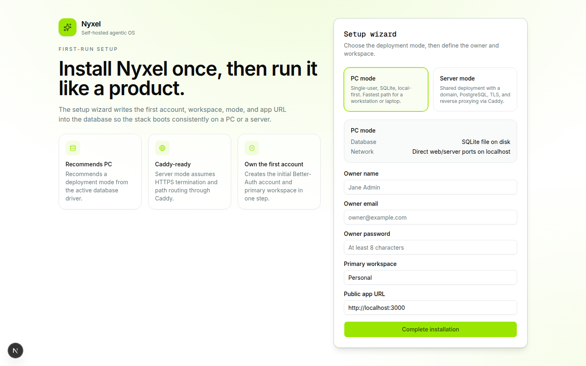
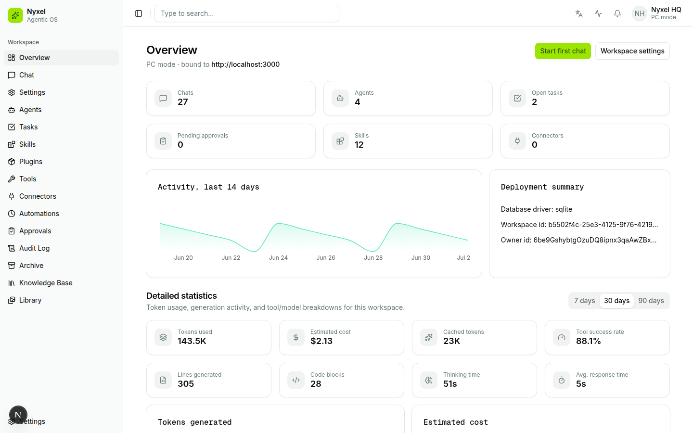
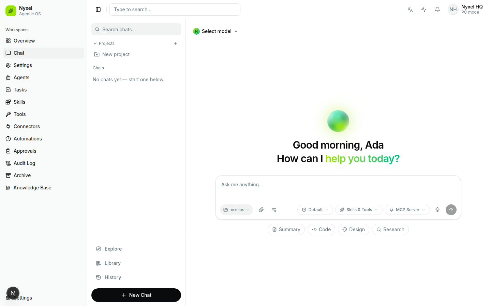
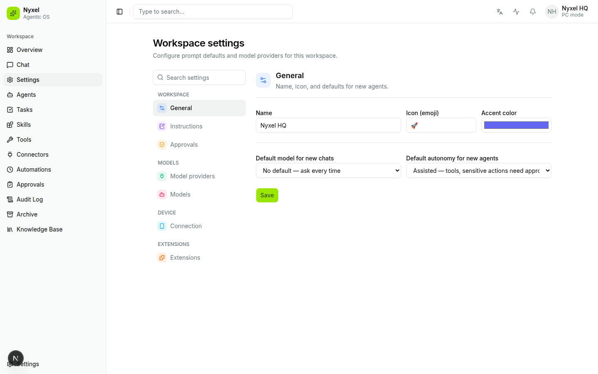
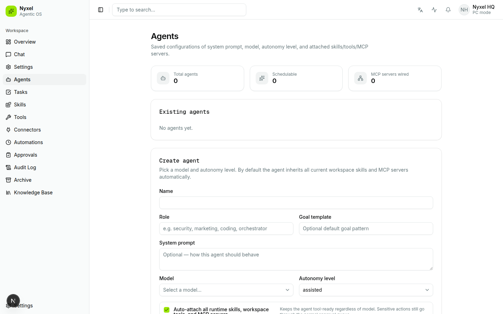
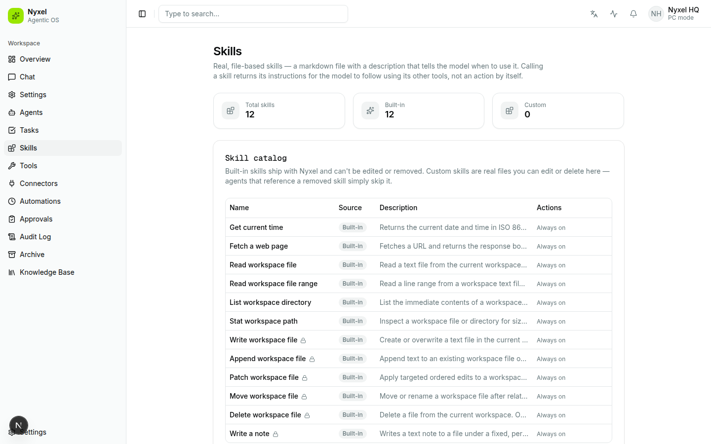
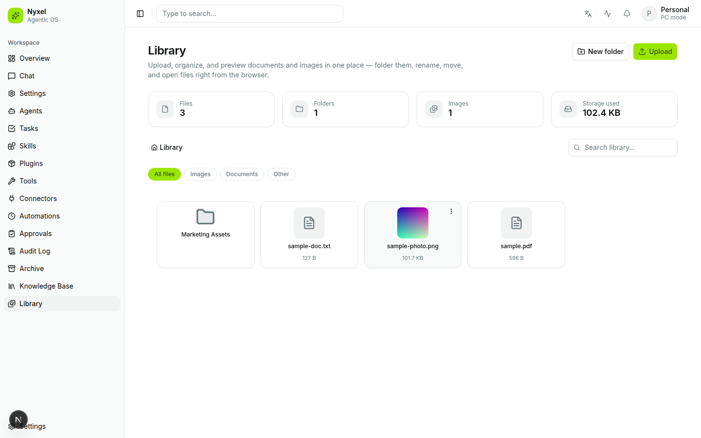
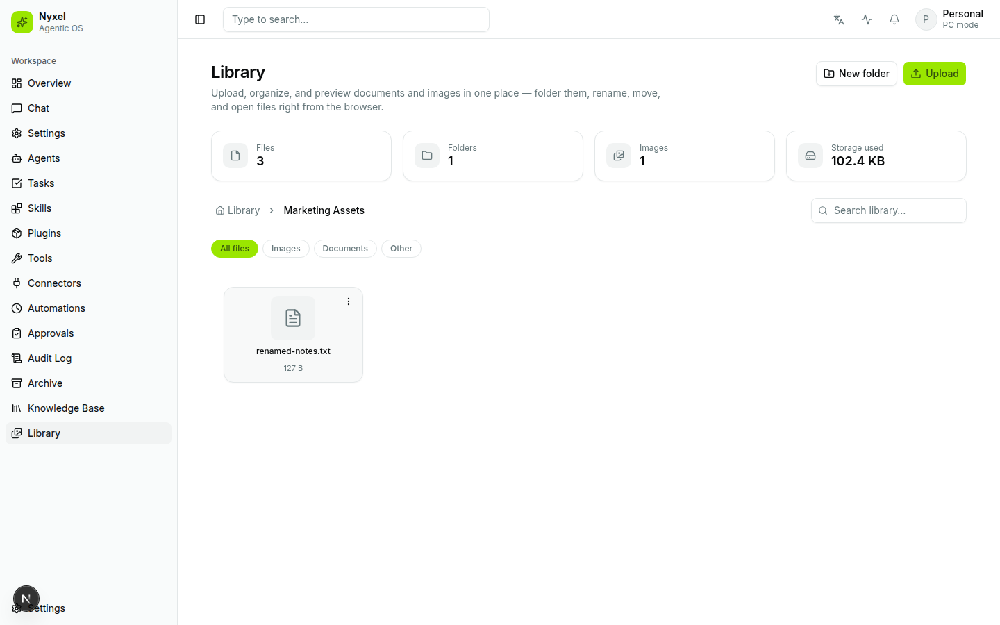

# ✨ NyxelOS: The Agentic Operating System 🧠

NyxelOS is not just another app; it's a fully open-source, self-hosted agentic OS designed to bring your local and cloud AI models into a single, cohesive interface. Think of it as unifying your digital existence: local servers, cloud services, autonomous agents, and knowledge base—all in one place.

🛡️ **Local-First & Open Source** 🌐
Run NyxelOS entirely on your hardware or deploy it across a server cluster. Full control, full privacy. Contributors are welcome!

---
### 🚀 Core Principles of NyxelOS
*   **🧠 Agentic Autonomy:** Beyond simple chat. Our system supports normal chats, advanced autonomous agents, and Super-Agents capable of complex tasks.
*   **🌳 Local-First:** Usable offline once the local model ecosystem is running. Your data stays yours.
*   **🧱 Modularity:** Swappable components—models, skills, MCP servers, and databases. Everything plugs into the robust core.
*   **🎨 Consistent UI:** A clean, predictable experience powered by `shadcn/ui`.

### 🛠️ Tech Stack at a Glance
*   **Backend:** Bun runtime, Hono, tRPC. The intelligence layer.
*   **Frontend:** React, TanStack Start/Query, `shadcn/ui`. The visual interface.
*   **Data:** Drizzle ORM layer supporting PostgreSQL (Server Mode) or SQLite (PC/Dev Mode).
*   **Connectivity:** Vercel AI SDK & Official MCP TypeScript SDK for seamless model and tool integration.

---
### 📖 Getting Started & Deployment Modes

#### 🚀 Just want to run it? `npx create-nyxel`
No checkout, no build toolchain — this pulls the published `ghcr.io/quavon-dev/nyxelos-*` images and writes only the Docker Compose files you need to run NyxelOS.
```bash
npx create-nyxel
# or: bunx create-nyxel

cd nyxel
docker compose up -d
```
See [`packages/create-nyxel`](packages/create-nyxel) for all options (`--mode`, `--dir`, `--tag`, `--domain`, ...).

> 💡 Everything below this point (`git clone`, `bun install`, `docker compose -f docker-compose.*.yml up --build`) is the **development** workflow — building from source. Use it if you're contributing to NyxelOS, not just running it.

#### 💻 Local Development (Dev Machines / Quick Test)
Ideal for development and personal testing without Docker. Requires [Bun](https://bun.sh) 1.3+.
```bash
git clone https://github.com/Quavon-dev/nyxelos.git
cd nyxelos
bun install

# Setup environment files
cp apps/server/.env.example apps/server/.env
cp apps/web/.env.example apps/web/.env.local

bun dev # Start both server and web interfaces
```
> 💡 **Tip:** For models to show up automatically, run Ollama or LM Studio beforehand. API keys can also be configured in `apps/server/.env`.

#### 🍎 macOS Companion Server (Phase 4)
Give Nyxel access to your local ecosystem! The `apps/companion-macos` package functions as a dedicated MCP server for deep integration with:
*   📅 Calendar Events
*   📞 Contacts
*   🖼️ Photo Search
*   🔔 Reminders

This is the bridge between AI and your desktop life. Full detail in [`apps/companion-macos/README.md`](apps/companion-macos/README.md).

#### 🐳 Building the Docker Images From Source (PC Mode / Server Mode)
Prefer to build from this checkout instead of using the published images? Same compose files, with `--build`:

**🖥️ PC Mode (Testing/Home Server):**
```bash
cp .env.example .env   # Secure your app with BETTER_AUTH_SECRET
docker compose -f docker-compose.pc.yml up --build
```
Access at `http://localhost:3000`.

**🌐 Server Mode (Production/Uptime):**
```bash
cp .env.example .env   # Set NYXEL_DOMAIN, POSTGRES_PASSWORD, etc.
docker compose -f docker-compose.server.yml up --build -d
```
Access at `https://NYXEL_DOMAIN`. Caddy handles TLS certificates, health checks (`/healthz`), and routing.

---
### 🖼️ Screenshots

| First-run setup | Overview dashboard |
| --- | --- |
|  |  |

| Chat | Workspace settings |
| --- | --- |
|  |  |

| Agents | Skills catalog |
| --- | --- |
|  |  |

| Document & Image Library | Folder navigation |
| --- | --- |
|  |  |

---
### 📂 Project Structure Deep Dive
```
apps/
  web/: Frontend UI (Next.js, shadcn/ui) 🎨
  server/: Core Agent Engine (Bun, Hono, tRPC) 🔥
  companion-macos/: Local macOS Data MCP Server (Phase 4 integration) 🍎

packages/
  db/: Drizzle Schema & Repository Layer (Postgres/SQLite) 🗄️
  model-providers/: Handles routing between local and cloud AI models. ☁️⚡️
  create-nyxel/: The `npx create-nyxel` / `bunx create-nyxel` setup CLI. 🚀
```

### ⚙️ Development Tools
*   **DB Migration:** Use `bun run db:generate` and `bun run db:migrate`.
*   **Knowledge Base:** All documentation lives in the Obsidian vault, automatically synced via ADR-0013.

### 🤖 CI/CD
*   **Pull requests:** lint, typecheck, and build run on every PR (`.github/workflows/ci.yml`), alongside a conventional-commit PR title check, CodeQL analysis, and a dependency review.
*   **Docker images:** `apps/server` and `apps/web` are built on every PR (validation only) and pushed to `ghcr.io/quavon-dev/nyxelos-server` / `nyxelos-web` on merges to `main` and version tags (`.github/workflows/docker.yml`).
*   **`create-nyxel`:** built and smoke-tested on every PR, published to npm on `create-nyxel@<version>` tags (`.github/workflows/package.yml`).

🔗 **Architecture Plan:** [`docs/ARCHITECTURE.md`](docs/ARCHITECTURE.md)
🔗 **Installation Guide:** [`docs/INSTALL.md`](docs/INSTALL.md)
🔗 **Obsidian Knowledge Base:** [`knowledge-base/`](knowledge-base/)